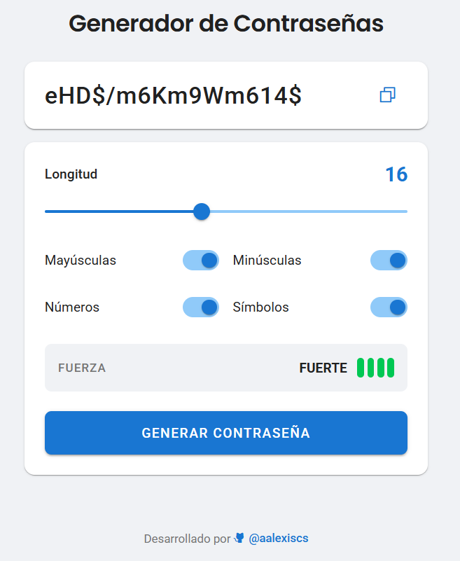

# 🔐 Generador de Contraseñas (Password Generator)

Aplicación web rápida y sencilla para crear contraseñas seguras. Personaliza la longitud, elige los tipos de caracteres y copia tu nueva contraseña con un solo clic.

  

 

🔗 **Prueba la aplicación aquí:** [https://aalexiscs.github.io/password-generator/](https://aalexiscs.github.io/password-generator/)

## 🛠️ Tecnologías y Dependencias

Este proyecto fue desarrollado utilizando tecnologías web estándar y algunas librerías externas:

- **HTML5, CSS3 y JavaScript (Vanilla)**
- **Google Fonts**: Fuentes Roboto y Poppins.
- **Phosphor Icons**: Iconos de la interfaz.
- **Toastify JS**: Notificaciones emergentes.

---
*🤖 Nota: Este proyecto fue desarrollado con la asistencia de un agente de Inteligencia Artificial (Gemini 3 Pro).*
